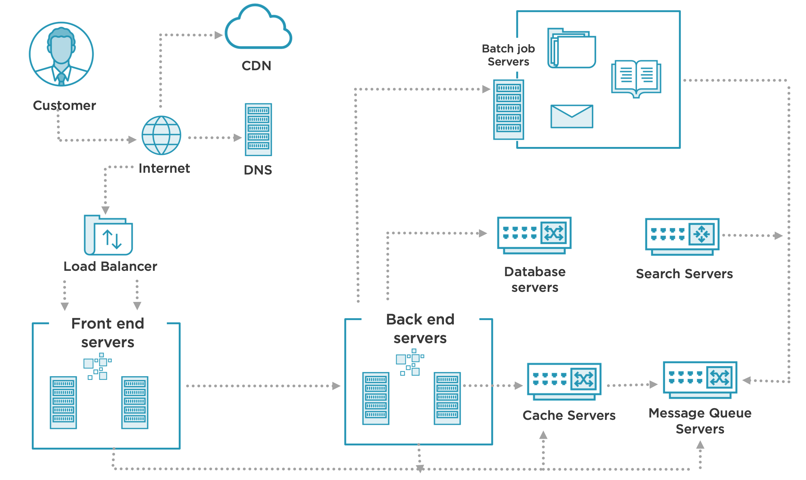

**What are distributed systems**
- **Distributed System:** a collection of independent computers that appear to its users as one computer.

- **Characteristics:**
    - Concurrency: all servers operate at the same time
    - Independence: servers run and fail independent of each other
    - No shared clock: servers do not share a global clock

**Globomantics E-commerce Website**
- Application architecture should evolve around the business model and not around the technology
- Primary use cases: account signup, item listing, catolog search, checkout and payment; shipping, tracking and delivery; feedback, refund and returns. 

**Traditional Client/Server Model**
- Client --> DNS --> Server (Single) --> CDN
- **DNS**  (Domain Name System): a hierarchical and decentralized naming system for computers and translates domain names to IP addresses.
- **Content Delivery Network** (CDN): a collection of distributed servers that deliver static pages and other content to a user based on their geographic location.

**Vertical Scalability**
- Upgrade hardware and/or network throughput
- No application redesign needed
- Works even better with Virtual servers
- Cost inefficent, hardware limitations, operating system design

**Horizontal Scalability**
- Run each component of your application on multiple servers
- Add/Remove servers as needed
- Commodity hardware instead of specialized servers

Customer --> Internet, DNS, CDN --> Load Balancer --> Front-End Servers --> Backend Servers (Cache Servers, Message Queue Servers) <--> Database, Batch job, Search Servers.

