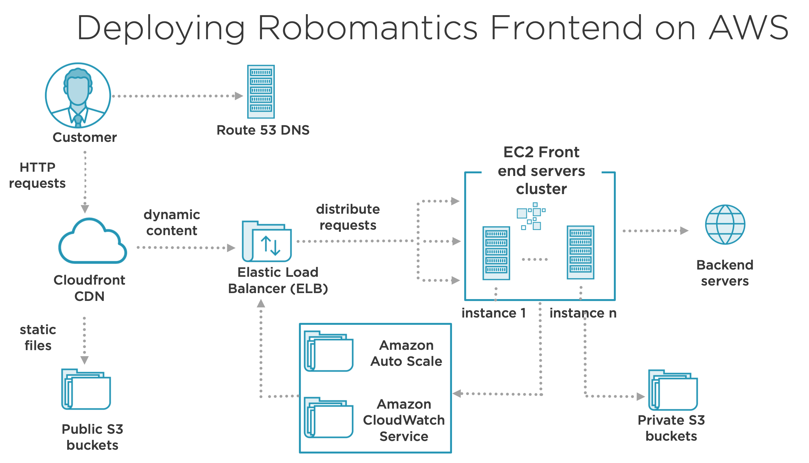
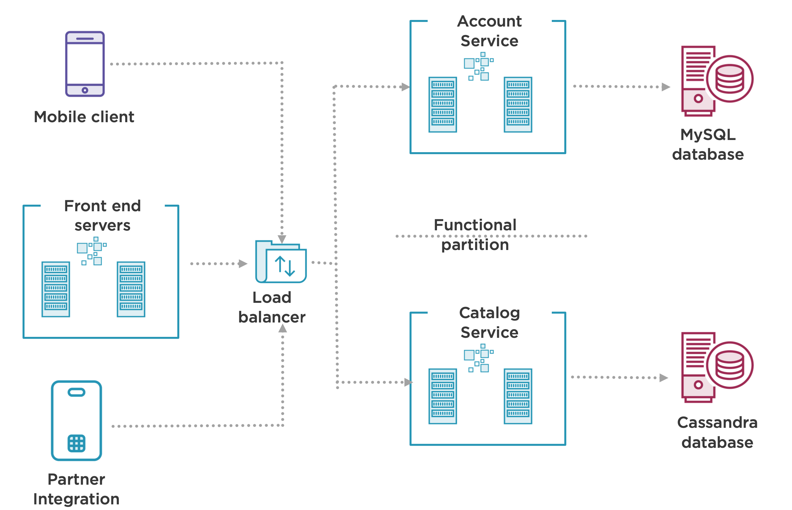

## Components of a Distributed System
### Building the Front-end Layer
- State management: User Session, Memory, Local files, Resource Locks.
- Keep your Servers Stateless. Scale Horizontally by adding more Servers.
- Client and server communicate over HTTP.
    - HTTP protocol is stateless
    - Establish HTTP session with Cookies in request and response headers.
    - Cookies sent with every individual request.
    - Store session data in an external datastore.
    - For local files, use CDN or an Object store.

**Front-end Layer Components**
- DNS (Domain Name System) eg. Route 53, easydns.com.
- CDN (Content Delivery Network) eg. Akamai, Amazon CloudFront.
- Load Balancer (eg. Elastic Load Balancer, HAProxy, Nginx).
- Caching (eg. Browser, Redis/Memcached).

**Deploying Robomantics Frontend on AWS**

### Handling Business Logic with Web Services
- Web Services encapsulates the business logic and hides complexity behind an API contract.
- **Functional Partitioning:**
    - Split a large system into a set of smaller, loosely coupled and independent web services - each focusing on a subset of funcitonality of the overall system.

**REST**
- Resource oriented architectural style that defines a set of constraints used for creating web services.
- Why REST?
    - Leverage HTTP features (PUT, GET, POST)
    - Status codes (200 - OK, 400 - Bad Request)
    - Security Controls
    - Caching
    - Ecosystem of Monitoring tools

**Scaling Web Services**
- No shared store: use cache, database, and MessageQueues.
- Stateless Servers: scale by adding replica servers (AutoScale).
- Load Balancers: Between clients and backend servers.
- Isolate Server Failures: Servers routinely ping load balancer.
- Easy Maintenance: Zero downtime update of services.

**Ditributed Transactions**
- Implementing an operation consisting of a set of web service calls that should either fail or pass?

### The Data Layer
**Replication**
    - Synchronize state between mulitple servers (primary and secondary)
    - Scale read throughput and provide higher availability
    - Each server holds an identical copy of data
- Replication Challenges:
    - Introduces complexity
    - Replication lag
    - Only applicable for scaling reads

**Sharding (Partitioning)**
- Divide dataset into smaller chunks
- Each server processes only a subset of data
- Isolate failure of servers from each other

**Sharding key**
- Determines the distribution of the dataset among your servers (shards or partitions)

**Sharding Challenges:**
- Sharding function can be complex
- Mappings can break
- Querying data across shards

**CAP Theorem**
- States that it's impossible to build a distributed system that would simultaneously guarantee Consistency, Availability and Partition Tolerance
- **Consistency**: All servers see the same data
- **Availability**: Server can process requests evern when other servers are down
- **Partition Tolerance**: System is functional even when servers cannot communicate.

### Handling Asynchronous Communication
- Synchronous Communication: A call is made to a remote server, which blocks until the operation completes.
- Asynchronous Communication: The caller doesn't wait for the operation to complete before returning.

**Asynchronous Communication Patterns**
- Fire and Forget: Caller doesn't care if the operation completes or not.
- Callback: Register a callback to be notified when the operation completes
- Event-based: Client emits events. Subscribers react independently

**Message Queues**
- Buffers and Distributes asynchronous requests.
- Messages are platform independent (JSON, XML).
- Producers and Consumers run as separate processes and hosted on separate servers.

- Producers:
    - Initiate asynchronous calls
    - Create a message and push it to the Queue
    - Message format serves as the contract
- Message Broker:
    - Provides the following features: message queuing, persisting, routing and delivery
    - Configuration over customization
    - Support higher throughput and Scalability
- Consumers:
    - Process requests asynchronously
    - Implemented in the application code: pull model, push model

**Message Routing**
- Direct worker queue method
    - Single work queue identified by name
    - Multiple producers and consumers
    - Each message routed to one consumer
    - Ideal for long running tasks: video transcoding, data classification, image resizing

