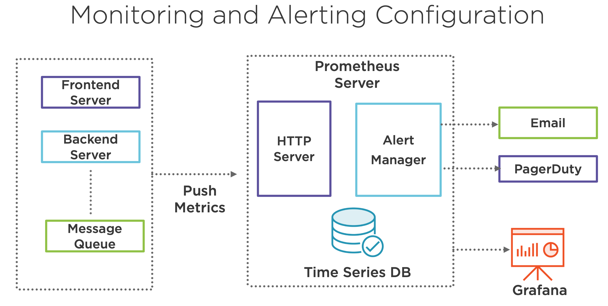

## Distributed Systems in the Real World
- Adopting a Distributed Systems Mindset: logging, automation, monitoring, alerts, deployment, organization, data center.

#### Scaling teams and organization
- Scaling teams: avoiding inefficienies when expanding workforce.
- Scaling operations: horizontal scaling resulting in hunderds of additional servers.

#### Automating testing and deployment
- Automated testing: unit, integration and performance tests
- Continous delivery: automate build and deployment.
- Use server definitions: re-create environments on demand.

#### Setting up Monitoring and Alerting
- Discover the problem --> Respond to the problem --> Investigate the problem --> Test and Roll out the fix.

#### Collecting and viewing metrics
- System metrics: CPU, memory, network, disk, TPS, no. of requests, cache hit ratio.
- Application metrics: page impressions, no. of click, items added to cart.
- Business metrics: daily active users, no. of items sold, login failure count.

