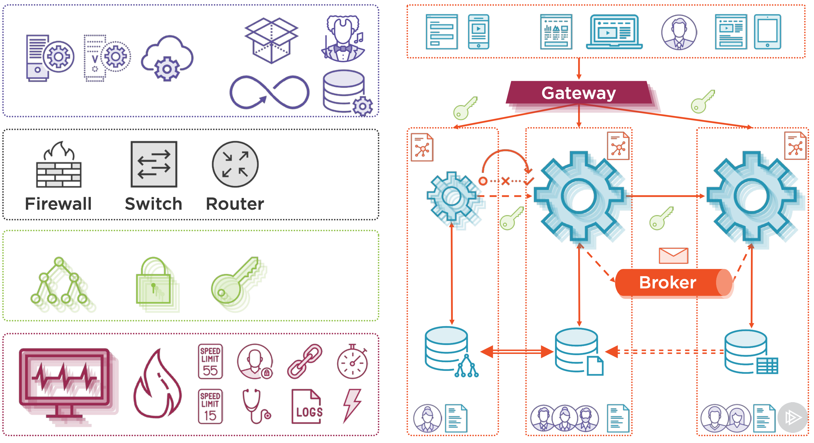

#### Microservices Elements

**Building a Monolith** (eCommerce webapp)
- Model: 
    - User (Address) --> Order (Invoice) --> Product (Catetory, Media) --> Supplier
- Single database
- User interface
- Single monolith, single database, user interface, expose APIs, multiple instances
- Pros: simple to develop, simple to build, simple to test, simple to deploy, simple to scale.
- Cons: new team members productivity, growing teams, code harder to understand, no emerging technologies, scale for bad container, overloaded container, huge database

**Building Microservices**
- Domain
- Subdomains: user auth, order, product
- Dependencies: domain driven design

**Organization**
- Team per subdomain
- Right-sized teams
- Independent, responsible
- Agile and devops
- Communication, management
- Codebase: documentation, repository

**Data Store**
- Independent
- Different requirements
- Relational
- NoSQL
- GraphDB

- **Data Synchronization**
    - No distributed transaction: long run two phases commit distributed transaction 
    - Losing immediately consistent
    - Eventual consistency
    - Capture data change
    - Event sourcing patterns: same product can have a difference price, discription.
    - Akka, Kafka, RabbitMQ
    - Debezium

**User Interface**
- Independent teams
- Own set of components
- Unique UI
- Single application
- UI composition: server side, client side

**Services**
- **Remote Procedure Invocation (RPC)**
    - Request/reply
    - Synchronous
    - Asynchronous
    - REST, SOAP, gRPC
- **Messaging**
    - Message or event
    - Broker or channel
    - Publish and Subscribe
    - Kafka, RabbitMQ
- **Protocol Format Exchange**
    - Text
    - XML, JSON, YAML
    - Human readable
    - Easy implement
    - Binary
    - gRPC
- **APIs and Contracts**
    - Contract
    - SOAP, REST, gRPC
    - WSDL, Swagger, IDL
- **APIs and Contracts per Device**
    - Different devices
    - Different needs
    - Different APIs
    - Different contracts
- **Distributed Services**
    - Service Registry
        - Locations change
        - Phone book
        - Self registration
        - Discovery
        - Invocation
        - __Eureka, zookeeper, consul__
    - Cross-origin Resource Sharing
        - CORS
        - Same-origin policy
        - Same protocol, server, port
        - Restrict cross-origin
        - HTTP headers
    - Circuit Breaker
        - Services available
        - Network failure
        - Heavy load
        - Domino effect
        - Invoke via proxy
        - Deviate calls
        - Reintroduce traffic
        - __Hystrix, JRugged__
    - Gateway
        - Access individual services
        - Single entry point (API gateway)
        - Unified interface
        - Cross-cutting concerns
        - API translation
        - __Zuul, Netty, Finagle__
- **Security**
    - Authorization and Authentication
        - Identity and Access Management
        - Single Sign-on
        - Kerberos, OpenID, OAuth 2.0, SAML
        - __Okta, Keycloak, Shiro__
    - Access Token
        - Stores information about user
        - Exchanged between services
        - JSON Web Token
        - Cookie

**Scalability and Availability**
- Vertical: more CPU and RAM
- Horizontal: more machines
    - Service replication
    - Clustering
    - Scale up and down
- **Client and Balancing**
    - Several instances
    - Which instance to choose
    - Registry
    - Round-robin, weight, capacity
    - __Ribbon, Meraki__
- **Availability**
    - Be operational
    - Single Point of Failure
        - Gateway
        - Broker
        - Registry
        - IAM
    - Multiply instances
    - Sync

**Monitoring**
- Monitoring and Dashboard
    - Many moving parts
    - Many machines
    - Centralized
    - Visual
    - __Kibaba, Grafana, Splunk__
- Health Check
    - Service running
    - Incapable handling request
    - Health check API: database status, host status
- Log Aggregation
    - Understand behavior
    - Write logs
    - Read each log file: aggregate logs
    - __LogStash, Splunk, PaperTrail__
- Exception Tracking
    - Errors
    - Throw an exception
    - Record exceptions
    - Investigation and resolved
- Metrics
    - System slowing down
    - Performance issues
    - Gather statistics
    - Aggregate metrics
    - __DropWizard, Actuator, Prometheus__
- Auditing
    - Behavior of users
    - Login, logout
    - Visited pages
    - Browsed products
    - Record user activity
- Rate limiting
    - Third-party access
    - Control API usage
    - Defend DoS attacks
    - Limit traffic
    - In a period of time
    - Monetize our APIs
- Alerting
    - Tons of information
    - How to be proactive
    - Fix error when occurs
    - Configure threshold
    - Trigger alerts
- Distributed Tracing
    - Requests span services
    - Logs
    - Trace entire request
    - Correlation id
    - Chain of calls
    - __Dapper, HTrace, Zipkin__

**Deployment**
- Host:
    - Physical server
    - Virtual server
    - On-permise
    - In the cloud
- Multiple services per host
    - Microservice per host
    - Serveral services per host
    - Serveral services per virtual host
- Containers
    - Packaging microservice
    - With dependencies
    - Container image
    - Easy to move from environment
    - Scale up and down
    - __Docker, rkt__
- Orchestrator
    - Multiple containers
    - Multiple machines
    - Start at the right time
    - Failed containers
    - Kubernetes, Mesos, Docker Swarm
- Continuous Delivery
    - Automate deployment
    - Cost-effective
    - Quick
    - Reliable
    - Build, test, deploy
    - Jenkins, Asgard, Aminator
- Environments
    - Production
    - Dev, test, QA, staging
    - Integration
    - Versionning
- External Configuration
    - Different environments
    - Different configuration
    - Activate functionality
    - Externalize configuration
    - Archaius, Consul, Decider

#### Revisiting the Microservice Elements
- Organize your team --> Data storage --> User interface --> Distributed services --> Security --> Monitoring --> Deployment

