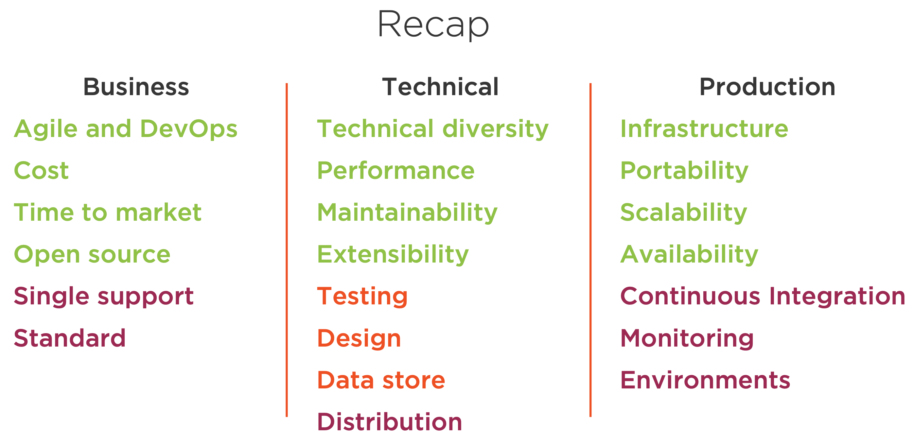

#### Are Microservices Right for Your Organization?

**Challenges**
- Globally competitive world
- Business is more and more complex
- Highly available, scalable, and secure
- Reducing costs
- Open, robust, and agile technologies
- Maintain legacy
- Time-to-market
- Small batches of work
- To production quickly

**Business Concerns**
- __Organization__
    - One microservice is one full-stack team
    - Small team easier to manage
    - Easier estimation
    - Agile and DevOps
    - Separate central management
- __Recruiting__
    - Microservices and trendy
    - People will be motivated
    - Mix developers
    - Common knowledge
    - Collectively learning
- __Training__
    - Embrace new technologies faster
    - Lots of technologies
    - Lots of languages
    - Lots of data store
    - Constantly train the team
    - Integration from other teams is difficult
- __Standard__
    - No standard technological stack
    - Based on some standards
    - There is no standard
    - There is no "one single framework"
    - Integration of several technologies
    - There is no "single support"
- __Open Source__
    - Lots of open source products
    - Dynamic open source communities
    - Access to code and documentation
- __Cost__
    - Start small, start cheap
    - Grow up when needed
    - Small team
    - Cheap deployment on the Cloud
    - Small budget
    - Invest more when business is running
- __Time to Market__
    - Faster to market
    - Earning revenues faster
    - Small batches of work
    - Moved to production faster

**Technical Concerns**
- Design
    - How to partition the system
    - How small
    - Design is an art
    - Depends on complexity of model
    - __Domain driven design__
- Technical Diversity
    - Appropriate programming languages
    - Best performance
    - Adopt the right database
    - Right platform
    - Pick up the right tool for the right job
    - Technology agnostic
- User Interface
    - The web-right framework
    - Well designed components
    - Great browsing experience
    - Responsive user interface
    - Fits well on several devices
    - Need to integrate all UI together
    - Aggregation can be tricky
- Distribution
    - Communicating over a network
    - Highly distributed
    - Network fallacies
    - Address complexity of distributed systems
    - Network failure will occur
    - Deal with failures
    - Circuit breakers
- Data Store
    - One database per subdomain
    - Services are loosely coupled
    - Different style of databases
    - Keeping data in sync
    - Capture data change
    - Eventual consistency
    - Avoid distributed transactions
- Performance
    - Right language, database, tools
    - Performance benefit
    - Optimize each microservice
    - Benchmark and performance tuning
    - Integration, network slows down
- Security
    - Security is difficult
    - Multiply the number of services
    - Multiple the number of flaws
    - Access tokens
    - DevSecOps (or DevOpsSec)
- Testing
    - Less code to test
    - Mock
    - Test in isolation
    - Integration testing
    - Complex test environment
    - Testing in production
    - Chaos testing
- Maintainability
    - Less code to maintain
    - Less code to understand
    - Focuses on a subdomain of your model
    - Modification done in time
- Extensibility
    - Extensible by design
    - New feature, new microservice
    - Access 3rd party, new microservice
    - Give partners access to your system

**Production Concerns**
- __Continuous Integration/Delivery__
    - Deploy, Update, Replace, Scale
    - Independent DURS
    - CI and CD
    - Errors are identified
    - Well-automated testing and deployment pipelines
- Portability
    - CI builds container images
    - Image used across the deployment process
    - Image is a snapshot of a microservice with dependencies
    - Application is portable
    - Orchestrator
- Infrastructure
    - Hybird infrastructure
    - Traditional IT
    - Private cloud
    - Public clouds
    - Datacenters
    - The right mix to handle workload
- Scalability
    - Meet the demand increased usage
    - Application doesn't slow down
    - More users than anticipated
    - Scale out on public cloud
- Availability
    - Ensure a level of operational performance
    - Uptime
    - Available by design
    - Enable graceful degradation
    - Critical components must be highly available
    - Operational complexity
- Monitoring
    - Constantly monitor your system
        - More logs to aggregate
        - More heart beats to control
        - More metrics to gather
    - Alerts to detect the system slowing down
    - Large volumne of monitoring data
    - External calls and rate limit
    - Possible security issues and fraud

#### Recap

